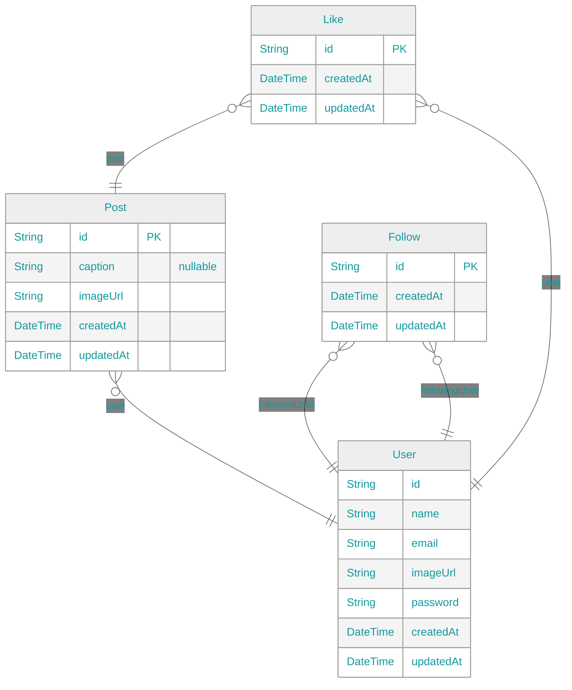

# 📸 Instagram Clone

## 🔗 Links

### 🥳 [Website](https://app.instagram-clone.net/)

### 📓 [Storybook](https://app.instagram-clone.net/storybook/)

### 🚀 [API](https://api.instagram-clone.net/)

### 📈 [Build Analytics](https:&#x2F;&#x2F;github.com&#x2F;kentayamada-dev&#x2F;instagram-clone&#x2F;actions&#x2F;runs&#x2F;2968653747)

### 📧 <a href="mailto:user@support@instagram-clone.net">support@instagram-clone.net</a>

## ⚡ Playgrounds

## 🛠️ Tech Stack

- Frontend

  - React (Next.js)
  - Storybook
  - Atomic Design
  - Fully Responsive
  - Chakra UI
  - SWR
  - TypeScript
  - Light/Dark Modes
  - Internationalized Routing
  - Cypress
  - reg-suit

- Backend

  - Node.js (NestJS)
  - Apollo
  - Prisma
  - TypeScript
  - GraphQL
  - Helmet
  - CORS
  - Rate Limiting
  - Jest

- Auth

  - Cookie
  - Passport
  - JWT
  - Password hashing (bcrypt)

- DB

  - PostgreSQL
  - Cloudinary
  - Relational Database

- Misc
  - Monorepo (Turborepo)
  - husky
  - lint-staged
  - ESLint
  - GraphQL Code Generator
  - Prettier
  - CSpell
  - CI/CD (GitHub Actions)

## 💾 ERD

| Diagram                                                                     | Notation                                                                      |
| --------------------------------------------------------------------------- | ----------------------------------------------------------------------------- |
|  |  |

<!--

-->
