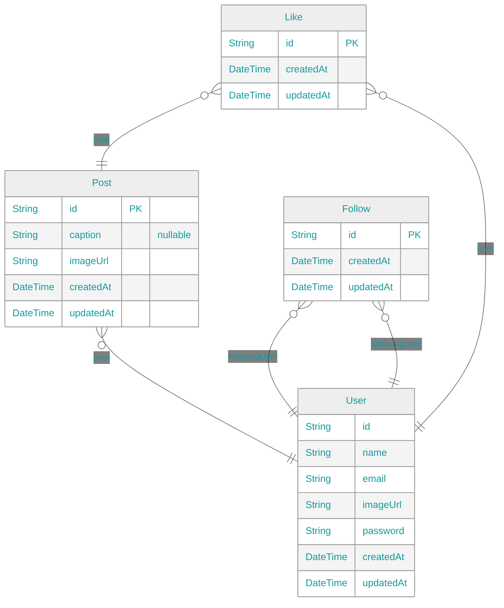

<h1 align="center">Instagram Clone</h1>

## 🔗 Links

### 🥳 [Website](https://app.instagram-clone.net/)

### 📓 [Storybook](https://app.instagram-clone.net/storybook/)

### 🚀 [API](https://api.instagram-clone.net/)

### 📈 [App Analytics](https://kentayamada-dev.github.io/instagram-clone/)

### 📧 <a href="mailto:user@support@instagram-clone.net">support@instagram-clone.net</a>

## ⚡ Playgrounds

## 🛠️ Tech Stacks

### Website

<table>
    <thead>
        <tr>
            <th align="center">React (Next.js)</th>
            <th align="center">Storybook</th>
            <th align="center">Chakra UI</th>
            <th align="center">SWR</th>
            <th align="center">React Hook Form</th>
            <th align="center">TypeScript</th>
            <th align="center">i18next</th>
            <th align="center">Faker</th>
            <th align="center">LottieFiles</th>
            <th align="center">Emotion</th>
            <th align="center">Light/Dark Modes</th>
            <th align="center">Responsive</th>
        </tr>
    </thead>
    <tbody>
        <tr>
            <td align="center"></td>
            <td align="center"></td>
            <td align="center"></td>
            <td align="center"></td>
            <td align="center"></td>
            <td align="center"></td>
            <td align="center"></td>
            <td align="center"></td>
            <td align="center"></td>
            <td align="center"></td>
            <td align="center"></td>
            <td align="center"></td>
        </tr>
    </tbody>
</table>

### API

<table>
    <thead>
        <tr>
            <th align="center">Node.js (NestJS)</th>
            <th align="center">Apollo GraphQL</th>
            <th align="center">Prisma</th>
            <th align="center">TypeScript</th>
            <th align="center">GraphQL</th>
            <th align="center">Jest</th>
            <th align="center">Joi</th>
            <th align="center">Faker</th>
        </tr>
    </thead>
    <tbody>
        <tr>
            <td align="center"></td>
            <td align="center"></td>
            <td align="center"></td>
            <td align="center"></td>
            <td align="center"></td>
            <td align="center"></td>
            <td align="center"></td>
            <td align="center"></td>
        </tr>
    </tbody>
</table>

### Auth

<table>
    <thead>
        <tr>
            <th align="center">JWT</th>
            <th align="center">Passport</th>
            <th align="center">Cookie</th>
            <th align="center">bcrypt</th>
        </tr>
    </thead>
    <tbody>
        <tr>
            <td align="center"></td>
            <td align="center"></td>
            <td align="center"></td>
            <td align="center"></td>
        </tr>
    </tbody>
</table>

### DB

<table>
    <thead>
        <tr>
            <th align="center">PostgreSQL</th>
            <th align="center">Cloudinary</th>
        </tr>
    </thead>
    <tbody>
        <tr>
            <td align="center"></td>
            <td align="center"></td>
        </tr>
    </tbody>
</table>

### App Analytics

<table>
    <thead>
        <tr>
            <th align="center">Astro</th>
            <th align="center">React</th>
            <th align="center">Tailwind CSS</th>
            <th align="center">ChartJS</th>
            <th align="center">daisyUI</th>
            <th align="center">Cypress</th>
            <th align="center">reg-suit</th>
            <th align="center">Google Analytics</th>
            <th align="center">Next.js Bundle Analyzer</th>
            <th align="center">Lighthouse</th>
        </tr>
    </thead>
    <tbody>
        <tr>
            <td align="center"></td>
            <td align="center"></td>
            <td align="center"></td>
            <td align="center"></td><td align="center"></td>
            <td align="center"></td>
            <td align="center"></td>
            <td align="center"></td>
            <td align="center"></td>
            <td align="center"></td>
        </tr>
    </tbody>
</table>

### Misc

<table>
    <thead>
        <tr>
            <th align="center">Turborepo</th>
            <th align="center">Husky</th>
            <th align="center">lint-staged</th>
            <th align="center">ESLint</th>
            <th align="center">GraphQL Code Generator</th>
            <th align="center">Prettier</th>
            <th align="center">CSpell</th>
            <th align="center">GitHub Actions</th>
        </tr>
    </thead>
    <tbody>
        <tr>
            <td align="center"></td>
           <td align="center">
           <td align="center">
           <td align="center"></td>
           <td align="center">
           <td align="center">
           <td align="center">
           <td align="center">
        </tr>
    </tbody>
</table>

## 💾 ERD

| Diagram                                                                     | Notation                                                                      |
| --------------------------------------------------------------------------- | ----------------------------------------------------------------------------- |
|  |  |

<!--

-->
